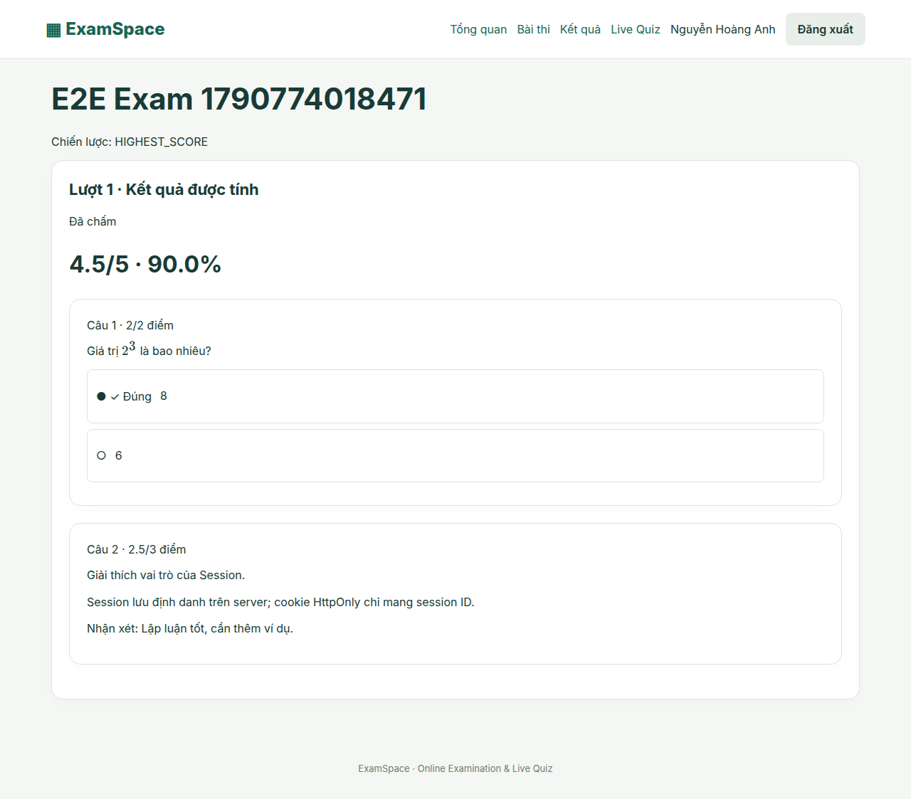
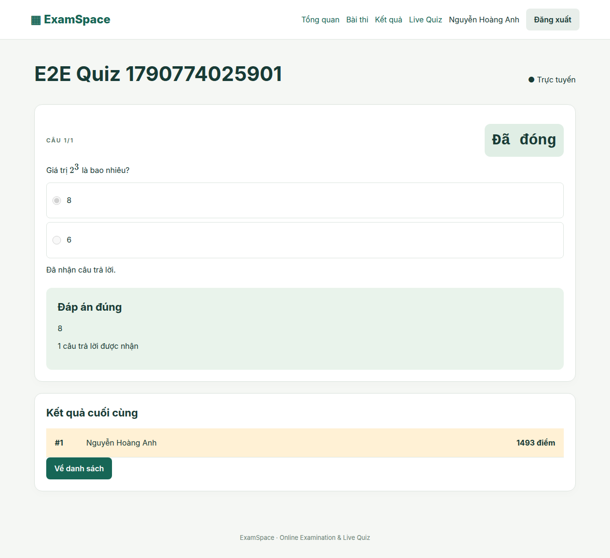

# ExamSpace — Thi trực tuyến & Live Quiz

Nền tảng bài tập lớn Công nghệ Web và Dịch vụ trực tuyến: giảng viên soạn đề, tổ chức thi và Quiz; sinh viên làm bài có lưu tiến độ; quản trị viên quản lý tài khoản. Core dùng PostgreSQL thật và server-side Session, có migrations, demo seed và kiểm thử trình duyệt.

## Tính năng

- **Tài khoản:** ADMIN/TEACHER/STUDENT, Argon2id, PostgreSQL Session, RBAC/ownership, khóa tài khoản, CSRF và exact CORS.
- **Lớp & ngân hàng:** roster, 4 loại câu hỏi, Markdown/GFM/LaTeX/code, ảnh private Supabase Storage qua backend.
- **Exam Mode:** builder 5 bước, giao lớp, lịch/thời lượng/số lượt, câu cố định + random pools, shuffle, snapshot, timer server, autosave/retry/resume, submit idempotent và auto-submit.
- **Chấm & kết quả:** exact-set objective, essay manual/feedback, release IMMEDIATE/AFTER_CLOSE/MANUAL, highest/latest attempt, visibility rules, realtime monitoring, analytics, Excel và PDF tiếng Việt.
- **Live Quiz:** phòng mã 6 số, login join, lobby, câu hỏi/deadline realtime, server scoring, reveal/leaderboard/final, reconnect và reduced motion.

## Kiến trúc & công nghệ

React 19 + TypeScript + Vite 8 + Tailwind 4 + TanStack Query + React Hook Form/Zod. Express 5 + Socket.IO 4 trên cùng HTTP server; Prisma 7/pg + PostgreSQL cho nghiệp vụ và Session. Supabase Storage private chứa ảnh; ExcelJS/PDFKit xuất báo cáo. Frontend không quyết định identity/time/score và không chứa service key.

```text
apps/api/          API, sockets, jobs, Prisma schema/migrations/seed, fonts
apps/web/          React SPA, role routes, editor, Exam, Quiz, analytics
packages/shared/   Schemas, DTOs, enums, typed socket events
tests/             Playwright E2E và production deployment smoke
docs/              SRS, SDD, deployment, DoD audit, screenshots
.github/workflows/ CI + GitHub Pages
render.yaml        Render backend blueprint
```

## Chạy local

Cần Node 22 LTS ≥22.12 và PostgreSQL UTF8 hoặc Supabase development project.

```bash
npm ci
cp apps/api/.env.example apps/api/.env
cp apps/web/.env.example apps/web/.env
node -e "console.log(require('node:crypto').randomBytes(48).toString('hex'))"
```

Điền `DATABASE_URL`, tùy chọn `DIRECT_URL`, và `SESSION_SECRET` vừa tạo vào **apps/api/.env**. Để dùng ảnh, thêm `SUPABASE_URL`, `SUPABASE_SERVICE_ROLE_KEY`, tạo private bucket `question-assets`. Frontend `.env` đã có public URLs localhost; không điền secret vào VITE_*.

```bash
npm run db:generate
npm run db:migrate
npm run db:seed
npm run dev
```

Web: `http://localhost:5173` · API health: `http://localhost:3000/api/health`. Backend chạy local; không cần deploy Render để thử. Nếu thiếu Storage credential, các flow không có ảnh vẫn chạy; upload trả503 rõ ràng. [Bảng env và hướng dẫn đầy đủ](docs/DEPLOYMENT.md).

## Demo accounts — chỉ development

Password mặc định **DevOnly!2026** cho:

| Role    | Email                                      |
| ------- | ------------------------------------------ |
| ADMIN   | admin@exam.local                           |
| TEACHER | teacher1@exam.local, teacher2@exam.local   |
| STUDENT | student1@exam.local … student12@exam.local |

Seed: 1 admin, 2 teacher, 12 student, 2 lớp, 2 banks, 24 câu đủ 4 loại, 3 Exam và 1 Live Quiz. Có kết quả minh họa của student2 qua service thi thật. Seed idempotent không reset record; DEMO_PASSWORD chỉ áp dụng account mới. Production seed cần explicit flag; không dùng password development trên deployment thật.

## Commands & testing

| Command                  | Công dụng                                                |
| ------------------------ | -------------------------------------------------------- |
| npm run dev              | API + Vite                                               |
| npm run db:generate      | Prisma client                                            |
| npm run db:migrate       | Apply committed migrations, không reset                  |
| npm run db:seed          | Dữ liệu development                                      |
| npm run lint             | ESLint                                                   |
| npm run typecheck        | TypeScript strict cả app và tests                        |
| npm test                 | Unit/frontend                                            |
| npm run test:integration | Real PostgreSQL API/socket và Storage boundary           |
| npm run test:e2e         | Chromium Exam, Quiz, mobile/role guard                   |
| npm run test:deployment  | Production bundles, Pages subpath404/refresh, login, PDF |
| npm run build            | Shared + API + web production                            |
| npm audit                | Dependency advisory audit                                |

Integration/E2E cần TEST_DATABASE_URL trỏ DB riêng tên chứa `test`, đã migrate/seed. Cần `pdftotext` (poppler-utils) và `npx playwright install --with-deps chromium`. Deployment smoke cần build trước. Không chạy tests vào production DB. Lệnh chuẩn bị DB và CI được mô tả ở [DEPLOYMENT](docs/DEPLOYMENT.md#verification-commands).

Kết quả kiểm chứng gần nhất:22 unit/frontend +17 integration (có socket; một Storage provider-boundary test) +3 E2E pass. Lint/typecheck/build pass; npm audit 0 vulnerabilities. Deployment smoke và audit từng checkbox được ghi ở [VERIFICATION](docs/VERIFICATION.md). Storage external, Render và published Pages URL còn cần tài khoản thật để kiểm chứng; không có mock trong runtime Core.

## Ảnh giao diện thực

Chụp từ Playwright với API/PostgreSQL thật; fixture E2E có tên tự sinh.





## Deployment

1. **Supabase:** tạo project, lấy DB URLs, chạy migrations; tạo private Storage bucket, giữ service key ở backend.
2. **Render:** dùng render.yaml hoặc Web Service root monorepo; nhập env, deploy API, kiểm tra health/login/WSS. Free instance có thể sleep; dùng một instance luôn chạy cho thi realtime ổn định.
3. **GitHub Pages:** bật GitHub Actions trong Pages, đặt public `VITE_API_BASE_URL`/`VITE_SOCKET_URL`, chạy workflow Pages thủ công. Base path lấy từ Pages metadata;404.html phục hồi SPA deep links.
4. **Domain/cookie:** cập nhật exact CLIENT_ORIGIN. Cross-site cần Secure + SameSite=None và browser cho phép cookie; app/API custom subdomain cùng site hỗ trợ ổn định hơn.

Chưa deploy lên tài khoản cloud. Các bước cần tài khoản, custom domain, migrations/seed và troubleshooting nằm trong [hướng dẫn triển khai](docs/DEPLOYMENT.md).

## Tài liệu

- [SRS — yêu cầu và traceability](docs/SRS.md)
- [SDD — thiết kế thực tế, ERD, sequences, state machines](docs/SDD.md)
- [DEPLOYMENT — local, Supabase, Render, Pages](docs/DEPLOYMENT.md)
- [VERIFICATION — kết quả và từng checkbox DoD](docs/VERIFICATION.md)
- [Implementation checklist theo phase](docs/IMPLEMENTATION_CHECKLIST.md)
- [MASTER_SPEC — source of truth](MASTER_SPEC.md)

V1 chạy một API instance; chưa có horizontal scaling/load benchmark. Đề bị khóa cấu hình sau attempt đầu. API downtime không kéo dài deadline, đáp án chưa lưu có thể mất khi quá hạn. Chi tiết tradeoffs và các kiểm chứng external chưa thực hiện nằm trong SDD/VERIFICATION.
