# SDD — ExamSpace

## 1. Architecture overview

Modular monolith: Express REST và Socket.IO cùng HTTP server, PostgreSQL giữ dữ liệu nghiệp vụ và Session. React chỉ trình bày và gửi ý định; API quyết định identity, quyền, thời hạn, answer acceptance và score. Module trong process phát domain events sau transaction commit, socket chuyển thành state gửi từng người được phép.

## 2. Technology stack và lựa chọn

Node 22 LTS, TypeScript 5.9 strict; npm workspaces tránh phân tán DTO. React 19 + Vite 8 cho SPA; TanStack Query cho server state; React Hook Form/Zod cho form; React Router cho routes; Tailwind 4 và CSS cho layout. React Markdown + GFM + KaTeX + highlight hiển thị nội dung học thuật, không raw HTML. Recharts vẽ thống kê. Express 5, Socket.IO 4, Prisma 7 với adapter-pg, PostgreSQL, express-session/connect-pg-simple, Argon2id, Helmet/CORS/rate-limit; ExcelJS và PDFKit cho export. Phiên bản chính xác nằm trong package-lock.json.

Prisma 7 dùng `prisma.config.ts` cho CLI datasource và adapter runtime; không đặt URL trong schema. Pool runtime và migration URL được tách để dùng Supabase. [Prisma config reference](https://www.prisma.io/docs/orm/v7/reference/prisma-config-reference).

## 3. C4-like diagrams

### System Context

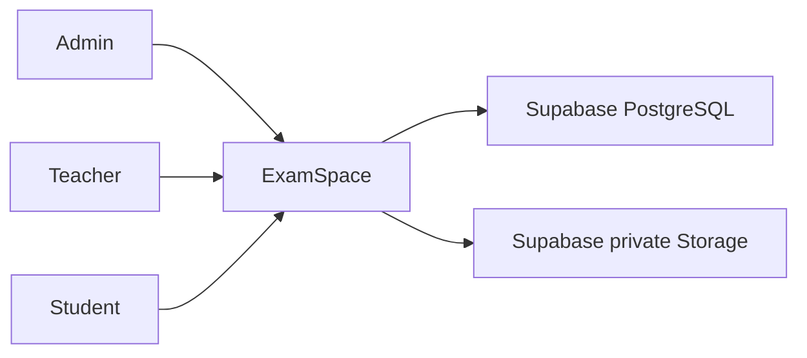

### Container

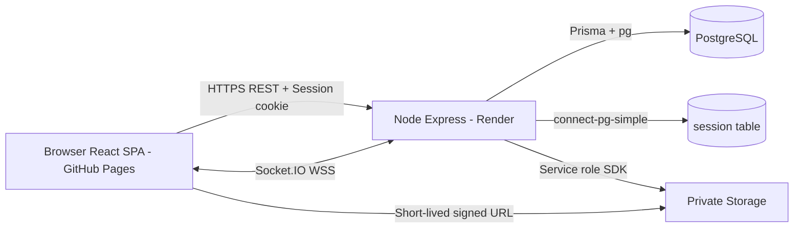

### Component

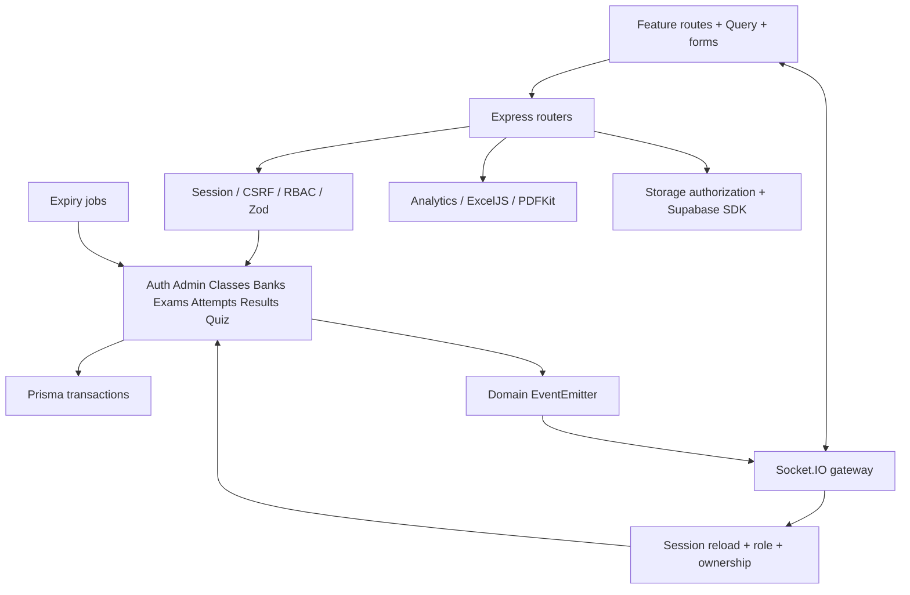

## 4. Repository/module structure

`apps/api/src/modules/{auth,admin,classes,question-banks,storage,exams,attempts,grading,results,analytics,exports,live-quiz}` chứa routes và service/logic khi cần. `middleware`, `sockets`, `jobs`, `config`, `db`, `utils` phục vụ các modules. `apps/api/prisma` chứa schema, 2 migrations và seed; `assets/fonts` có font và license.

`apps/web/src/features` chứa từng màn hình nghiệp vụ; `components` có UI primitives, Markdown; `lib` có API, socket, timer. `App.tsx` guard và lazy-load routes. `packages/shared/src/index.ts` chứa schema/DTO/enums và typed socket contract. `apps/api/test` chứa integration, `tests/e2e` chứa Playwright, test logic/UI nằm cạnh source. `docs` chứa tài liệu và ảnh thực.

## 5. Database design

21 bảng ứng dụng (không tính `_prisma_migrations`). UUID cho domain identity, email/studentCode unique, Decimal(10, 2) cho điểm, timestamptz cho thời gian nghiệp vụ. FK và compound unique đảm bảo quan hệ; index phục vụ ownership, membership, expiry và lookup room. Session có `sid`, JSON `sess`, timestamp `expire` theo connect-pg-simple.

Migration integrity thêm CHECK số điểm/thời hạn hợp lệ, unique partial `(examId, studentId) WHERE status = 'IN_PROGRESS'`, bật RLS trên tất cả bảng ứng dụng. SQL bổ sung này phải giữ trong migrations vì Prisma schema không diễn đạt đầy đủ. Giao dịch start lock Exam; save/submit/grade lock Attempt; Quiz lock Room rồi Quiz nếu cần. Admin dùng advisory transaction lock để serialize thay đổi role/status và kiểm tra lại acting admin.

Interactive transactions dùng cấu hình chung maxWait 5 giây/timeout 15 giây. Start batch-create snapshot; finalize batch-upsert autoScore và tái sử dụng trạng thái đã đọc dưới row lock để giảm round trips trên Supabase. Không thay isolation level/unique constraints. Chi tiết và regression: [SEED_RECOVERY](SEED_RECOVERY.md).

## 6. ER Diagram

```mermaid
erDiagram
  User ||--o{ Class : teaches
  User ||--o{ ClassMember : joins
  Class ||--o{ ClassMember : contains
  User ||--o{ QuestionBank : owns
  QuestionBank ||--o{ Question : contains
  Question ||--o{ QuestionOption : has
  Question ||--o{ QuestionAsset : attaches
  User ||--o{ Exam : creates
  Exam ||--o{ ExamClass : assigns
  Class ||--o{ ExamClass : receives
  Exam ||--o{ ExamQuestion : fixes
  Question ||--o{ ExamQuestion : supplies
  Exam ||--o{ ExamQuestionPool : draws
  QuestionBank ||--o{ ExamQuestionPool : supplies
  Exam ||--o{ ExamAttempt : receives
  User ||--o{ ExamAttempt : takes
  ExamAttempt ||--o{ AttemptQuestion : snapshots
  AttemptQuestion ||--o| AttemptAnswer : receives
  User o|--o{ AttemptAnswer : grades
  User ||--o{ LiveQuiz : owns
  LiveQuiz ||--o{ LiveQuizQuestion : contains
  Question ||--o{ LiveQuizQuestion : supplies
  LiveQuiz ||--o{ QuizRoom : runs
  User ||--o{ QuizRoom : hosts
  QuizRoom ||--o{ QuizParticipant : contains
  User ||--o{ QuizParticipant : plays
  QuizRoom ||--o{ LiveRoomQuestion : snapshots
  LiveRoomQuestion ||--o{ QuizAnswer : receives
  QuizParticipant ||--o{ QuizAnswer : submits
  Session {
    string sid PK
    json sess
    timestamp expire
  }
```

Session chứa userId trong JSON, không có FK tới User; auth luôn tra lại User để khóa/role có hiệu lực. Snapshot source IDs lưu tham chiếu lịch sử trong JSON/UUID, không phụ thuộc JOIN tới nội dung đang chỉnh.

## 7. Table/entity description

| Nhóm bảng                                       | Dữ liệu và invariant                                                                          |
| ----------------------------------------------- | --------------------------------------------------------------------------------------------- |
| User                                            | Hash password, role, status; không đưa hash vào DTO                                           |
| Class / ClassMember                             | Owner teacher, archivedAt; membership compound PK                                             |
| QuestionBank / Question                         | Owner, type, tags, difficulty, markdown, soft archive                                         |
| QuestionOption / QuestionAsset                  | Phương án và key; metadata đường dẫn storage riêng tư                                         |
| Exam / ExamClass                                | Lịch, duration, attempts, chiến lược/release/toggles; lớp được giao                           |
| ExamQuestion / ExamQuestionPool                 | Điểm câu cố định hoặc số câu/điểm/filter cho pool                                             |
| ExamAttempt                                     | attemptNo, startedAt/expiresAt/submittedAt, status, autoSubmitted, objective/manual/total/max |
| AttemptQuestion / AttemptAnswer                 | Snapshot JSON/thứ tự/điểm; answerJson hoặc text, điểm, feedback, người chấm                   |
| LiveQuiz / LiveQuizQuestion                     | Bộ câu khách quan, thứ tự, timeLimit/basePoints                                               |
| QuizRoom                                        | Code unique, status, index, openedAt/closesAt/revealedAt bền vững                             |
| QuizParticipant / LiveRoomQuestion / QuizAnswer | Membership unique, tổng điểm; snapshot; answer unique theo participant/question               |
| Session                                         | Phiên server-side và expiry có index                                                          |

## 8. Authentication/session design

Argon2id hash có salt; login regenerate SID chống fixation, tạo CSRF mới, save Session trước response. Cookie HttpOnly, host-only, path `/`, maxAge mặc định 8 giờ, secure production. Session lưu PostgreSQL cả local lẫn production. Logout destroy phiên và disconnect socket trong `session:<sid>`. `/me` lấy người dùng bằng userId từ Session và kiểm tra ACTIVE.

## 9. RBAC/authorization và RLS

Middleware `authenticate` và `allow` bảo vệ route; service/router kiểm tra owner teacher hoặc studentId/membership. Socket kiểm tra cùng Session và DB, không nhận client identity. Locked/role-changed user bị ngắt socket; role hiện tại được tra lại mỗi packet.

RLS bật nhưng không có anonymous/authenticated policies. Browser không truy vấn DB trực tiếp; backend dùng database owner hoặc role tin cậy có BYPASSRLS và quyền bảng. RLS là hàng rào với Supabase Data API, không thay RBAC nghiệp vụ. Storage private cũng không có public read policy; service role key nằm ở backend. Chi tiết cấp quyền: [DEPLOYMENT](DEPLOYMENT.md).

## 10. CSRF/security design

`GET /auth/csrf` khởi tạo Session/token. POST/PUT/PATCH/DELETE bắt buộc exact Origin thuộc allowlist và `X-CSRF-Token` so sánh constant-time theo byte. Login cũng yêu cầu CSRF. CORS credentials chỉ cho phép origin đã cấu hình, không wildcard. Socket handshake kiểm tra Origin kể cả WebSocket; mỗi packet reload Session, định kỳ 30 giây loại phiên hết hạn. Auth 30 requests/15 phút; socket 180 events/30 giây; dò mã Quiz 20/phút.

Helmet, Zod, JSON body limit 1 MB; ảnh memory buffer tối đa 5 MB, MIME và magic bytes phải phù hợp. Không log password/session token/answer payload; lỗi bất ngờ chỉ log event và error name. Markdown không dùng raw HTML. DTO student loại key/explanation trước release; không dùng CSS để giấu đáp án.

## 11. REST API design

Base `/api/v1`. Nhóm `/auth`, `/admin`, `/teacher/classes`, `/teacher/question-banks`, `/teacher/exams`, `/teacher/quizzes`, `/student/exams`, `/student/attempts`, `/assets`. Routes là contract chính xác; UUID params parse ở server. Payload envelope `{data}`, lỗi `{error:{code,message,details?}}`; create201, delete204, validation400, auth 401, forbidden403, hidden404, conflict409, rate429, unavailable503.

Pagination `page`, `pageSize` mặc định20, tối đa 100. User/question/results có lọc/phân trang; query results giới hạn student tại SQL nhưng export lấy toàn bộ tập được phép. Các thao tác release/grading/export luôn kiểm tra teacher owner.

## 12. WebSocket event architecture

Cùng `createServer(app)` với REST; `io.engine.use(sessionMiddleware)` chia sẻ persistent store. Cách tích hợp phù hợp [hướng dẫn express-session của Socket.IO](https://socket.io/how-to/use-with-express-session). Rooms `user:<id>`, `session:<sid>`, `exam-monitor:<examId>`, `attempt:<attemptId>`, `quiz-room:<roomId>`, `quiz-host:<roomId>`.

Exam events: `exam:monitor:join`, `exam:monitor:snapshot`, `exam:participant:status`, `exam:attempt:presence:join`, `exam:attempt:heartbeat`, `exam:attempt:submitted`, `exam:attempt:auto-submitted`. Quiz dùng `quiz:room:join/leave`, `quiz:host:start/next`, `quiz:answer`, `quiz:state`, cùng các event lobby/joined/left/started/question/closed/reveal/leaderboard/finished/accepted/rejected/error trong shared contract. Ack `{data}` hoặc `{error}`. `quiz:state` được cá nhân hóa vì ownAnswer khác nhau; state không chứa đáp án trước reveal.

Presence đếm nhiều socket của cùng attempt, grace 10 giây tránh flicker. Heartbeat 20 giây không phải tick timer. Reconnect fetch snapshot DB; không replay event log. Jobs và mutation emit sau commit; khi broadcast lỗi, request state lại phục hồi dữ liệu.

## 13. Exam và attempt state machine

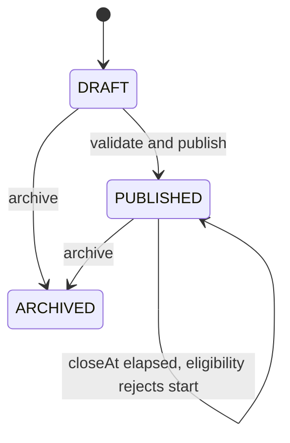

`CLOSED` có trong enum schema, chưa có job đổi Exam thành CLOSED; server dùng closeAt để từ chối lượt mới. Đề có attempts không cho edit cấu hình. Archive không xóa lịch sử và không rút ngắn snapshot deadline của lượt đang chạy.

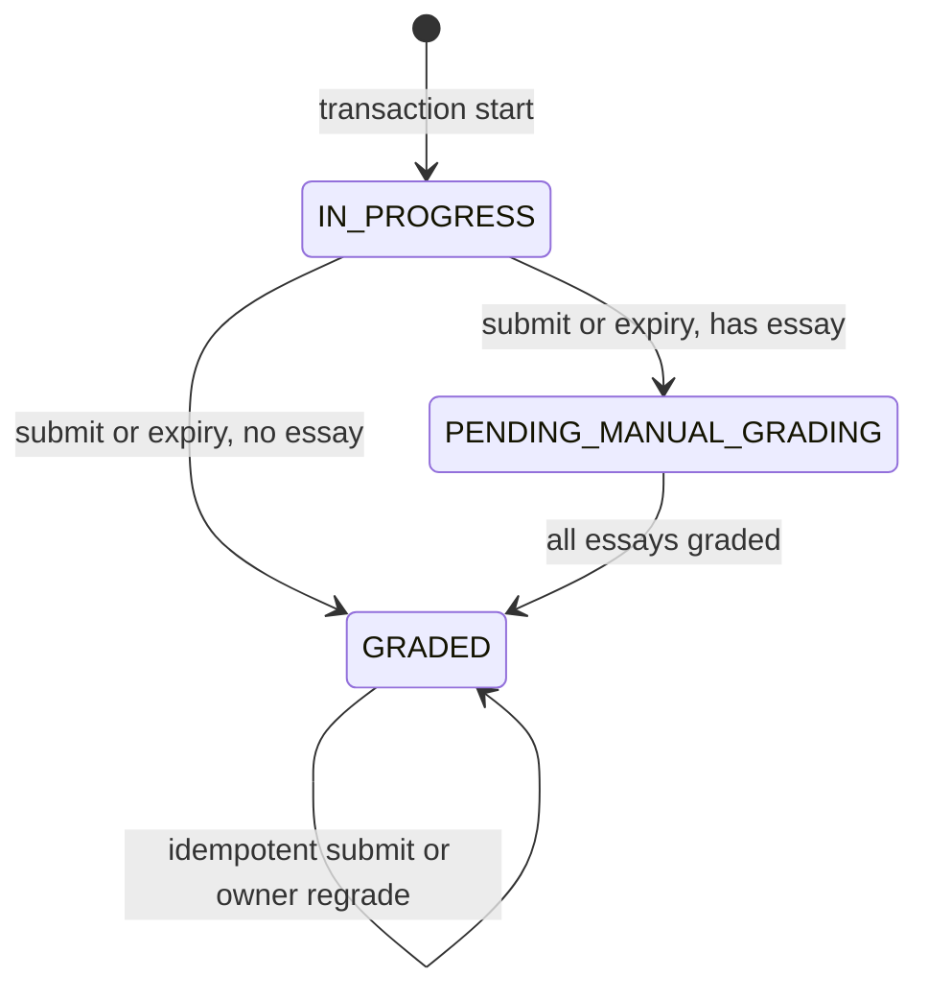

`SUBMITTED`/`AUTO_SUBMITTED` giữ trong enum nhưng finalize ghi trực tiếp GRADED hoặc PENDING_MANUAL_GRADING; `submittedAt` và `autoSubmitted` lưu cách nộp. Monitor gom các trạng thái đã nộp thành SUBMITTED.

## 14. Live Quiz state machine

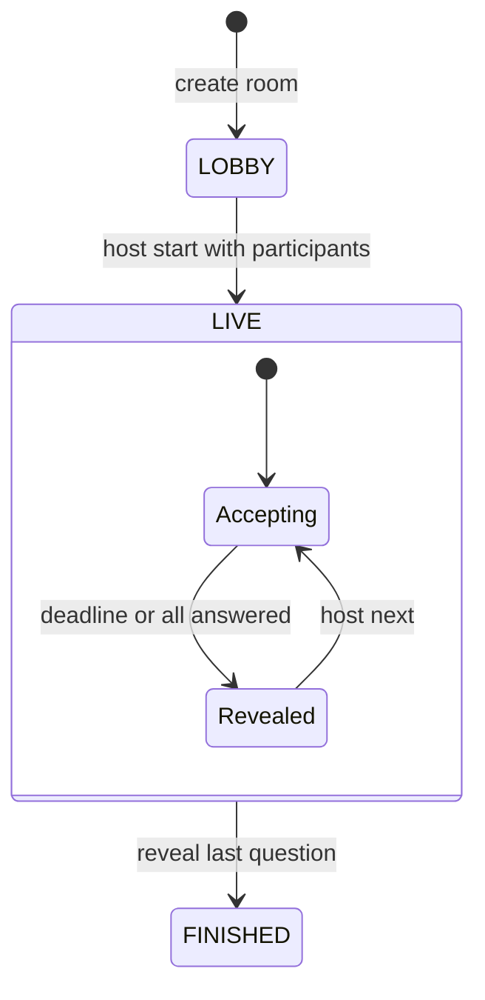

`CANCELLED` có trong enum nhưng v1 không có UI/command cancel. Substate được suy ra từ `revealedAt`; không có bảng state phụ. New join chỉ LOBBY, existing participant được reconnect LIVE/FINISHED. Khóa Room serialize answer/next/reveal; unique constraint bổ sung chống double scoring.

## 15. Sequence diagrams

### Login

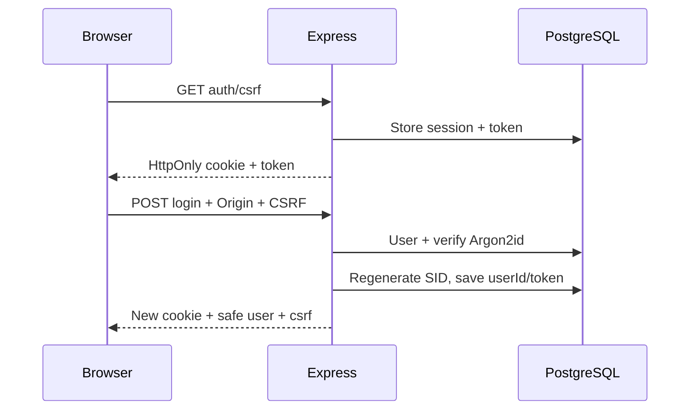

### Start Exam

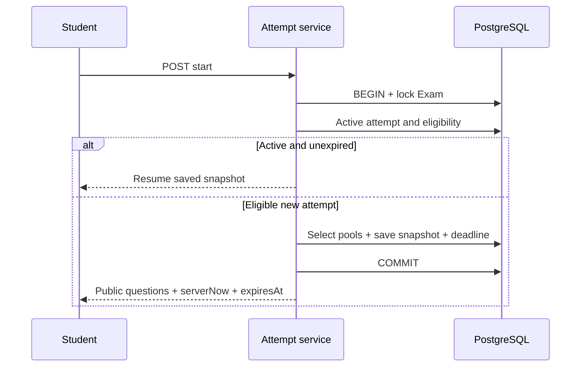

Expired active attempt được finalize trong transaction; nếu không đủ điều kiện tạo lượt mới, lỗi eligibility trả sau commit để giữ kết quả auto-submit.

### Autosave

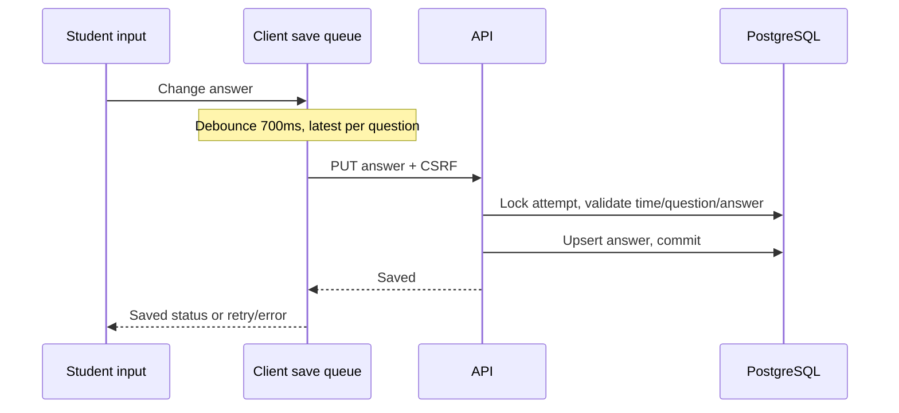

### Submit / Auto-submit

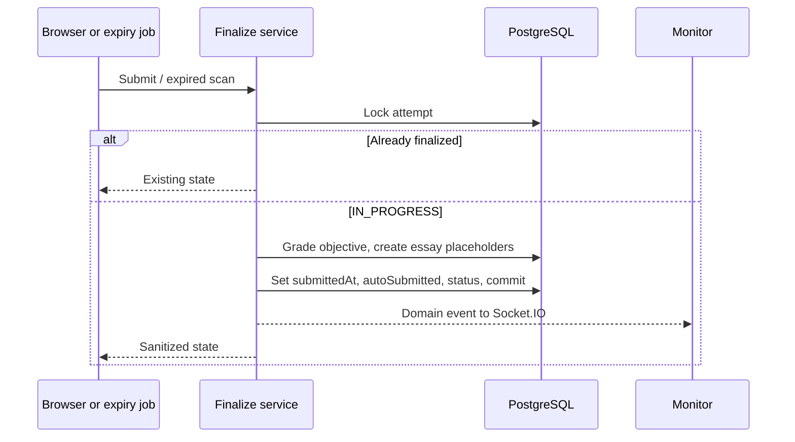

### Realtime Exam Monitoring

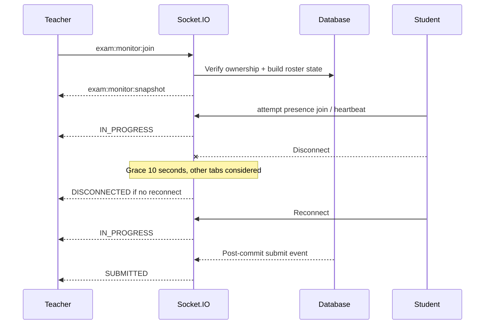

### Live Quiz

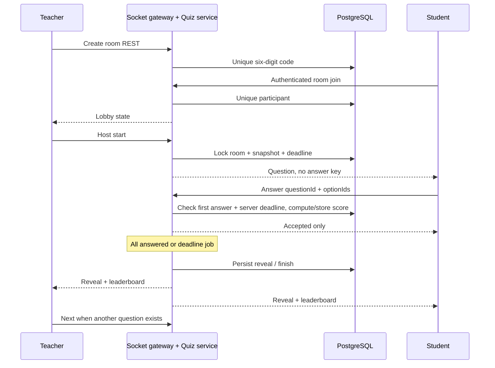

## 16. Timer synchronization

Attempt expiresAt = min(startedAt + durationMinutes, exam.closeAt). API trả serverNow; UI tính thời gian còn lại từ server delta cộng elapsed client, không quyết định quyền gửi. Browser refresh lấy thời gian server mới. Client deadline kích hoạt submit để UX nhanh; job 15 giây quét 100 expired attempts/batch bảo đảm server tự nộp khi offline. Save/start cũng reconcile expiry. Nếu API ngủ, trạng thái finalize trễ tới lần chạy tiếp, nhưng đáp án vẫn bị chặn theo deadline gốc.

Quiz lưu questionOpenedAt/questionClosesAt, job 1 giây đóng câu đến hạn; không gửi socket tick mỗi giây. Client sửa đồng hồ chỉ ảnh hưởng hiển thị tạm thời, không thay score/deadline server.

## 17. Snapshot/randomization

Start materialize mỗi AttemptQuestion, gồm source id/type/markdown/explanation/options+keys và điểm. Shuffle Fisher–Yates dùng crypto.randomInt; thứ tự được persist. TRUE_FALSE không shuffle options. Pool filters lấy câu còn hoạt động của teacher, loại fixed question IDs; bipartite matching các slot/pool xử lý pool chồng lấn, tránh thiếu giả do thuật toán greedy. Tối đa 500 câu sau materialize. Publish kiểm tra khả thi, Start kiểm tra lại dữ liệu hiện tại.

LiveRoomQuestion snapshot ở host Start. Question Bank sửa sau đó không đổi nội dung/keys của lượt hay room. API xây public DTO bằng allowlist, không gửi `snapshotJson` trực tiếp cho sinh viên.

## 18. Grading

Objective đúng toàn bộ tập IDs được full points; mọi trường hợp khác0. ESSAY trả null cho auto score, chờ teacher; input manual trong [0, question.points], lưu feedback/gradedBy/gradedAt. Recompute tổng trong cùng lock Attempt, totalScore null tới khi không còn essay chưa chấm.

Quiz: sai0; đúng `basePoints + round(basePoints * 0.5 * clamp(remainingMs / durationMs, 0, 1))`. Thời điểm receipt lấy server; không nhận score/time từ client. Unique answer và Room lock bảo đảm cộng điểm một lần. Leaderboard chỉ public khi reveal.

## 19. Result release

Tất cả policy yêu cầu GRADED. IMMEDIATE đọc ngay; AFTER_CLOSE đợi closeAt; MANUAL đợi manualResultsReleasedAt. Trước release chỉ trả trạng thái/lịch sử cơ bản. Sau release backend vẫn tách ba toggle key/explanation/detail score. Feedback đi kèm kết quả được công bố. HIGHEST_SCORE chọn graded score cao nhất, tie attemptNo mới hơn; chưa có graded thì fallback latest để biểu diễn pending. LATEST_ATTEMPT chọn lượt mới nhất kể cả pending, không biến null thành điểm0.

Analytics dùng final attempt theo strategy. Trung bình/cao/thấp/pass dùng percentage của lượt GRADED; phân bố năm khoảng20%; per-question rate chỉ câu khách quan có mặt trong final graded snapshot. Quy tắc mẫu số ở `analytics/service.ts` là contract thực tế.

## 20. Storage/file flow

Teacher POST multipart → quyền question owner → giới hạn/signature → random storagePath → Supabase private bucket → QuestionAsset. Nếu ghi metadata lỗi, thử remove object bù. Markdown lưu `asset:<uuid>`; component gọi API để lấy URL có hạn 300 giây. Student được truy cập khi reference thực có trong snapshot được phép; explanation asset còn phải qua result/reveal policy. Không cấp quyền ảnh mới thêm sau snapshot. Asset đã có snapshot dùng bị chặn xóa để bảo toàn lịch sử. Không cấu hình Supabase trả503 rõ ràng; không lưu file local thay thế.

## 21. Export design

ExcelJS workbook có Results, Summary, Attempts; numeric cells, frozen header và autofilter. PDFKit buffer với DejaVuSans.ttf/license trong repository để giữ Unicode Việt. Font resolver hỗ trợ source lẫn dist; build không được bỏ thư mục assets. PDF có tên/mã/lớp/email, lượt được tính, trạng thái/điểm và feedback. Endpoint export chỉ teacher owner. Export toàn bộ dữ liệu trong memory phù hợp BTL, chưa stream cho hàng triệu bản ghi.

## 22. Error handling và vận hành

AppError chứa status/code/message; Zod trả400, Multer413/400, Prisma unique409/not-found404; lỗi bất ngờ500 với thông báo an toàn. Client có loading/error/empty, autosave retry 3 lần và cảnh báo pending khi rời trang. API/socket lỗi không log secret/answer body. Health chỉ kiểm tra process, không kiểm tra DB. SIGTERM/SIGINT đóng Socket.IO, HTTP, jobs, session pool và Prisma. Có log startup/request_error/job/broadcast error; chưa có tracing/metrics hoặc audit log bền vững.

## 23. Testing architecture

Vitest unit và frontend jsdom; integration dùng Supertest, Socket.IO client, PostgreSQL test thật, không fallback memory. `TEST_DATABASE_URL` bắt buộc tên database chứa `test`. Một Storage test thay SDK provider để kiểm tra upload/signedURL/authorization (compensation có trong source), được ghi riêng; không đại diện Supabase network roundtrip. Export integration dùng ExcelJS đọc XLSX và pdftotext kiểm chứng Unicode. Playwright Chromium chạy API/Vite thật, Teacher/Student contexts độc lập, REST fixture thật. Test credentials đều synthetic local. [Kết quả và audit](VERIFICATION.md).

## 24. Deployment architecture

Frontend GitHub Pages static artifact gồm index.html, assets và404.html. BrowserRouter basename theo Vite base. Deep route nhận404.html rồi React render route, HTTP status ban đầu vẫn404. `configure-pages` xác định base path theo site metadata; custom domain quản lý ở GitHub Settings/DNS. Backend Render Node service một instance, shared HTTP/WSS, health `/api/health`, PORT từ platform. Migrations chạy trước start và không reset database. PostgreSQL/Storage Supabase tách khỏi filesystem Render. Hướng dẫn chi tiết và giới hạn cookie: [DEPLOYMENT](DEPLOYMENT.md).

## 25. Environment/configuration

Backend parse env bằng Zod khi startup: bắt buộc DATABASE_URL và SESSION_SECRET≥32 ký tự; HTTPS origin và secure cookie khi production; SameSite none cũng bắt buộc secure. DIRECT_URL dành Prisma CLI, DATABASE_URL cho runtime. Vite public URL được nhúng lúc build; thay backend URL cần build frontend lại. Pages workflow từ chối URL thiếu/không HTTPS; localhost chỉ fallback development. Bảng đầy đủ tại [DEPLOYMENT](DEPLOYMENT.md#environment-variables).

## 26. Design tradeoffs và limitations

- Một instance giúp presence/events đơn giản; horizontal scaling cần shared Socket adapter/presence/rate-limit và worker coordination, chưa có trong source.
- Khóa cấu hình đề sau attempt đầu stricter hơn chỉnh live, đổi lại tránh thay eligibility/điểm giữa các lượt. Snapshot tách khỏi ngân hàng.
- Không hỗ trợ offline submission; đáp án chưa save trước expiry không được nhận muộn. UI báo lỗi thay vì hứa đã lưu.
- GitHub Pages không rewrite200;404 fallback xử lý UI nhưng crawler thấy404 khi mở deep link. Đây là SPA ứng dụng đăng nhập, không tối ưu SEO.
- Cross-site cookie có thể bị browser chặn dù SameSite=None; custom app/API subdomain cùng site giải quyết vận hành.
- Render free có thể sleep; jobs không chạy trong lúc ngủ. Không dùng free sleeping service cho kỳ thi cần realtime liên tục.
- Markdown/KaTeX/highlight lazy chunk còn cảnh báo kích thước >500 kB; chưa đặt mục tiêu performance benchmark. pg8 có deprecation warning queued queries trong integration; test pass, cần rà soát trước nâng major9.
- Override deepmerge-ts/mysql2/uuid của ExcelJS/esbuild để vá transitive audit; lockfile và test bảo vệ reproducibility. npm còn deprecation notices của một số transitive ExcelJS packages, audit không phát hiện advisory tại lần kiểm tra.
- Chưa xác minh Supabase Storage thật, Render runtime cloud hay GitHub Pages published URL vì thiếu credentials; readiness/source không đồng nghĩa đã deploy.

## 27. Future development

Có thể mở rộng shared Socket adapter, durable job queue, streaming export, accessibility audit bằng screen reader và load testing; sau Core mới xét notification/SSO/proctoring. Các mục này không phải component đã triển khai hoặc dependency để chạy Core local.
